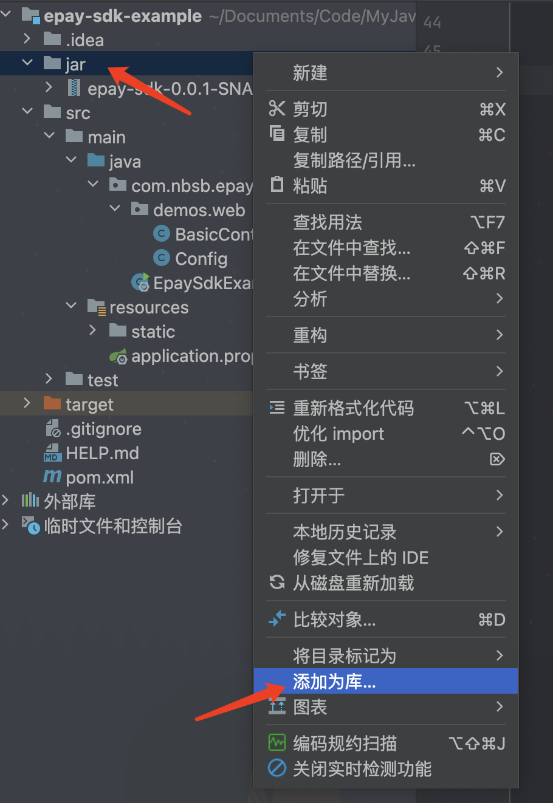

<h1 align="center" style="margin: 30px 0 30px; font-weight: bold;">epay-sdk</h1>
<h4 align="center">epay-sdk java sdk，引入此 sdk 可以快速将项目中引入支付功能</h4>

##  🐻‍❄️ 介绍

彩虹易支付、码支付 Java SDK

官方文档只有PHP示例的SDK，没有JAVA版的，api文档比较简单，因此自己封装了这个Api，与SpringBoot集成只需要引入Maven依赖或者jar包、配置商户信息即可实现api调用。

润物细无声！不影响自己之前的代码的同时尽需要引入很简单的jar包/maven包就可以使用

非常简单的代码帮无需自己使用大量代码进行封装调用，如果你有一些项目用到易支付，就需要复制粘贴大量的重复代码

🌟 右上角点个star，当代码更新时会第一时间通知你

🐮🍺 1分钟了解，1分钟上手，1分钟使用

示例代码仓库地址：https://github.com/nb-sb/epay-sdk-example.git

##  🕊️ 快速开始

### 1.引入maven

目前还没上传至maven库中，可以暂时引入jar包（jar目录下，复制jar包到你的项目中，这里在epay-sdk-example示例中演示）



### 2.yml配置商户信息

```xml
# 彩虹易支付或者码支付后台的配置
nbsb.pay.account.url=https://XXXX.com/
nbsb.pay.account.appId=1001
nbsb.pay.account.appKey=xxxxxxxxxxxxxxxxx
```

### 3. 支付服务Service注入到Spring容器

```java
@Configuration
public class Config {
    @Resource
    private Environment environment;
    @Bean
    public void init() {
        LoaderConfig loaderConfig = new LoaderConfig();
        loaderConfig.setEnvironment(environment);
        loaderConfig.afterPropertiesSet();
    }
}
```

配置相关信息，易支付/码支付api地址，用户id和密钥

```xml
nbsb.pay.account.url=https://XXXX.com/
nbsb.pay.account.appId=XXX
nbsb.pay.account.appKey=XXXXXXXXXX
```

### 4. 使用

提供多种使用方式

1.使用工厂进行创建是易支付还是码支付，并进行相关信息获取

填写自己相关配置即可，例如商品名称，商户订单号，金额，支付方式（这里定义好了枚举可以自己进行选择使用），回调地址和返回地址

```java
EPayFactory ePayFactory = new EPayFactory();
//获取码支付信息
EPayMZF ePay = (EPayMZF) ePayFactory.create(PayType.MZF);
//这里是模拟的数据，可以根据自己实际进行填写，更多案例可以看项目 epay-sdk-example测试用例中的内容
GetQRCmd cmd = new GetQRCmd("测试商品名称","20214014211111173712331","0.1",
PaymentMethod.ALIPAY,"https://baidu1.com/","https://baidu1.com/");
MapiResponse mapi = ePay.mapi(cmd);
System.out.println(JSON.toJSONString(mapi));
```

2.指定new 一个码支付的类`new EPayMZF()`或者易支付的类进行执行即可`new EPayYZF()`

```java
GetQRCmd cmd = new GetQRCmd("测试商品名称","20214014211111173712331","0.1",
        PaymentMethod.ALIPAY,
        "https://baidu1.com/","https://baidu1.com/");
EPayMZF ePayMZF = new EPayMZF();
MapiResponse mapi = ePayMZF.mapi(cmd);
System.out.println(JSON.toJSONString(mapi));
```

3.还有默认的查询订单信息

订单信息查询可以设置查询类型和订单号，订单号可以自己进行选择是本地订单号（就是上方自己获取收款信息的订单），商户订单就是易支付那边自动生成的订单号

```
//查询类型 1:本地订单号,2:商户订单号
```

```java
Query query = new Query(2,"20240421173712331");
EPayYZF ePayYZF = new EPayYZF();
Object mapi = ePayYZF.queryOrder(query);
System.out.println(JSON.toJSONString(mapi));
```

更多方法可以查看test文件

4.回调接口（系统中必须有的）

用于接收回调信息，进行订单状态的修改

需要继承实现`EPayInterface`接口,示例：

```java
@RestController
public class BasicController  implements EPayInterface {
    private static final Logger logger = LoggerFactory.getLogger(BasicController.class);

    @GetMapping("/pay/notify/")
    @Override
    public String onPayResult(@RequestParam Map<String, String> params) {
        // 打印所有传入的GET参数
        params.forEach((key, value) -> logger.info("GET parameter - {}: {}", key, value));
        // 验证签名！必须验证！如果你不想让你自己被盗刷的话（别人直接请求你就保存支付成功状态了）验证方法在SignUtil类中有，可以直接使用 SignUtil.map2Md5()

      	// 获取异步返回的内容
        // 进行修改订单状态并持久化存贮
        return null;
    }
}
```

通知类型：服务器异步通知（notify_url）、页面跳转通知（return_url）

请求方式：GET

请求参数说明：

| 字段名       | 变量名       | 必填 | 类型   | 示例值                           | 描述                    |
| :----------- | :----------- | :--- | :----- | :------------------------------- | :---------------------- |
| 商户ID       | pid          | 是   | Int    | 1001                             |                         |
| 易支付订单号 | trade_no     | 是   | String | 20160806151343349021             | 易支付订单号            |
| 商户订单号   | out_trade_no | 是   | String | 20160806151343349                | 商户系统内部的订单号    |
| 支付方式     | type         | 是   | String | alipay                           |                         |
| 商品名称     | name         | 是   | String | 测试商品                         |                         |
| 商品金额     | money        | 是   | String | 1.00                             |                         |
| 支付状态     | trade_status | 是   | String | TRADE_SUCCESS                    | 只有TRADE_SUCCESS是成功 |
| 业务扩展参数 | param        | 否   | String |                                  |                         |
| 签名字符串   | sign         | 是   | String | 202cb962ac59075b964b07152d234b70 | 签名算法                |
| 签名类型     | sign_type    | 是   | String | MD5                              | 默认为MD5               |

收到异步通知后，需返回success以表示服务器接收到了订单通知

## ⚡ 反馈与交流

有问题可以联系作者，有其他的想法或者有问题都可以联系作者或提Issue。你也可以在Issue查看别人提的问题和给出解决方案。

作者qq：3500079813

作者微信：扫码加好友拉你进交流群


