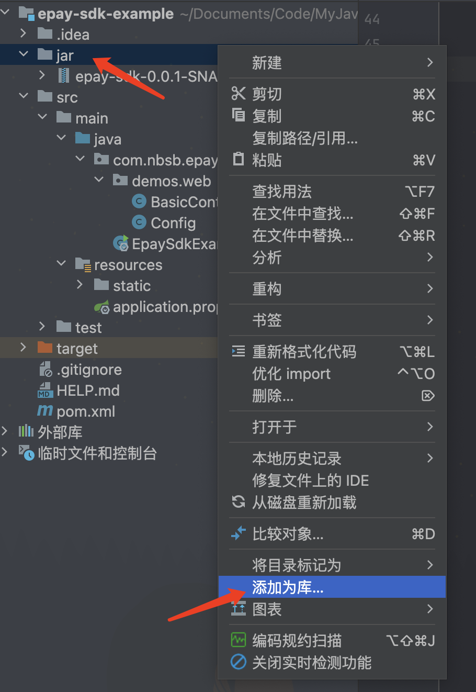

<h1 align="center" style="margin: 30px 0 30px; font-weight: bold;">epay-sdk</h1>
<h4 align="center">epay-sdk java sdk，引入此 sdk 可以快速将项目中引入支付功能</h4>

##  🐻‍❄️ 介绍

彩虹易支付、码支付 Java SDK

官方文档只有PHP示例的SDK，没有JAVA版的，api文档比较简单，因此自己封装了这个Api，与SpringBoot集成只需要引入Maven依赖或者jar包、配置商户信息即可实现api调用。

润物细无声！不影响自己之前的代码的同时尽需要引入很简单的jar包/maven包就可以使用

非常简单的代码帮无需自己使用大量代码进行封装调用，如果你有一些项目用到易支付，就需要复制粘贴大量的重复代码

🌟 右上角点个star，当代码更新时会第一时间通知你

🐮🍺 1分钟了解，1分钟上手，1分钟使用

示例代码仓库地址：https://github.com/nb-sb/epay-sdk-example.git

##  🕊️ 快速开始

### 1.引入maven

发布到 Maven Central 之后使用（版本以实际发布为准；当前仓库仍是 `0.0.1-SNAPSHOT`）：

```xml
<dependency>
    <groupId>io.github.nb-sb</groupId>
    <artifactId>epay-sdk</artifactId>
    <version>0.0.1</version>
</dependency>
```

尚未发布前可暂时引入 `jar/` 目录下的本地包（示例见 [epay-sdk-example](https://github.com/nb-sb/epay-sdk-example.git)）。维护者用 Central Publisher Portal 发布，不要走已停用的 OSSRH。



### 2.yml配置商户信息

```yaml
nbsb.pay.type: yzf
nbsb.pay.account.url: https://XXXX.com/
nbsb.pay.account.appId: 1001
nbsb.pay.account.appKey: xxxxxxxxxxxxxxxxx
nbsb.pay.account.clientIp: 203.0.113.10
```

Spring Boot 会自动装配 `EPayClient`（需配置 `nbsb.pay.account.appId`）。仍可用 `LoaderConfig` 把账号写入静态 `AccountConfig`。

### 3. 推荐用法：EPayClient + MerchantConfig

每个商户一份配置，避免静态全局账号。

```java
EPayClient client = EPayClient.builder()
        .payType(PayType.YZF)
        .config(MerchantConfig.builder()
                .url("https://XXXX.com/")
                .appId("1001")
                .appKey("xxxxxxxx")
                .clientIp("203.0.113.10")
                .build())
        .build();

GetQRCmd cmd = new GetQRCmd("测试商品", "20214014211111173712331", "0.10",
        PaymentMethod.ALIPAY, "https://shop.example/notify", "https://shop.example/return");
MapiResponse mapi = client.mapi(cmd);
OrderInfoResponse order = client.queryOrder(Query.byOutTradeNo(cmd.getOrderNo()));
```

易支付还支持：`submit` / `buildSubmitForm`（页面跳转）、`refund`、`queryMerchant`、`queryOrders`、`waitUntilPaid`、`verifyNotify` / `parseNotify`。

### 4. 兼容用法：工厂或直接 new

```java
EPay ePay = EPayFactory.create(PayType.MZF, merchantConfig);
MapiResponse mapi = ePay.mapi(cmd);

Query query = Query.byOutTradeNo("20240421173712331"); // 1=trade_no, 2=out_trade_no
OrderInfoResponse info = new EPayYZF(merchantConfig).queryOrder(query);
```

### 5. 回调接口（必须验签）

收到异步通知后校验签名，再改本地订单，最后返回 `success`。

```java
@RestController
public class BasicController implements EPayInterface {
    private final EPayClient client;

    @GetMapping("/pay/notify/")
    @Override
    public String onPayResult(@RequestParam Map<String, String> params) {
        NotifyPayload notify = client.parseNotify(params);
        if (notify.isPaid()) {
            // persist order paid: notify.getOutTradeNo()
        }
        return NotifyPayload.SUCCESS_ACK;
    }
}
```

通知类型：服务器异步通知（notify_url）、页面跳转通知（return_url）

请求方式：GET

请求参数说明：

| 字段名       | 变量名       | 必填 | 类型   | 示例值                           | 描述                    |
| :----------- | :----------- | :--- | :----- | :------------------------------- | :---------------------- |
| 商户ID       | pid          | 是   | Int    | 1001                             |                         |
| 易支付订单号 | trade_no     | 是   | String | 20160806151343349021             | 易支付订单号            |
| 商户订单号   | out_trade_no | 是   | String | 20160806151343349                | 商户系统内部的订单号    |
| 支付方式     | type         | 是   | String | alipay                           |                         |
| 商品名称     | name         | 是   | String | 测试商品                         |                         |
| 商品金额     | money        | 是   | String | 1.00                             |                         |
| 支付状态     | trade_status | 是   | String | TRADE_SUCCESS                    | 只有TRADE_SUCCESS是成功 |
| 业务扩展参数 | param        | 否   | String |                                  |                         |
| 签名字符串   | sign         | 是   | String | 202cb962ac59075b964b07152d234b70 | 签名算法                |
| 签名类型     | sign_type    | 是   | String | MD5                              | 默认为MD5               |

收到异步通知后，需返回success以表示服务器接收到了订单通知

## ⚡ 反馈与交流

有问题可以联系作者，有其他的想法或者有问题都可以联系作者或提Issue。你也可以在Issue查看别人提的问题和给出解决方案。

作者qq：3500079813

作者微信：扫码加好友拉你进交流群


